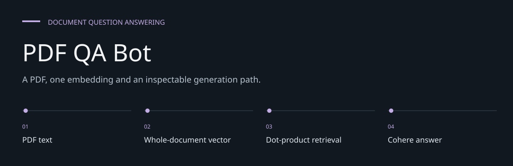
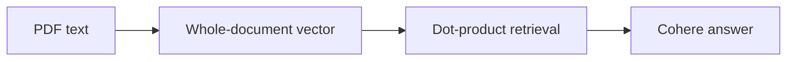
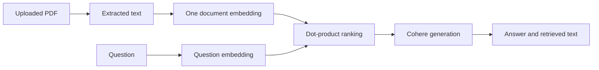

# PDF QA Bot

**A PDF, one embedding and an inspectable generation path.**

A Streamlit experiment that extracts text from a PDF, embeds the document and asks Cohere
to generate an answer from the retrieved text.


[Architecture](docs/ARCHITECTURE.md) · [Evaluation guide](docs/EVALUATION.md)

**Contents:** [The challenge](#the-challenge) · [Walkthrough](#walk-through-the-project) ·
[Implementation](#implementation-state) · [Design choices](#engineering-choices) ·
[Next evidence](#next-evidence-to-collect)

---

## The challenge

A document question-answering demo should make the information sent to a model visible. This
application extracts PDF text, embeds the whole document and displays retrieved text with the
generated answer, exposing a basic retrieval/generation path and its limitations.

## System at a glance



## Walk through the project

### 1. Upload a text PDF

PyPDF2 extracts text page by page. Image-only scans have no implemented OCR path.

### 2. Embed the whole text

The application creates one all-MiniLM-L6-v2 embedding for the complete document. Long text can be
truncated by the model rather than becoming a rich chunk index.

### 3. Ask a question

The query is embedded and dot-product scores rank in-memory document vectors. There is no
normalized-cosine calculation or relevance threshold.

### 4. Inspect the answer and context

The selected text and question are sent to Cohere. The UI shows context, but no page-level
citations or factual enforcement mechanism.

## How it works



[app.py](app.py) embeds each entire PDF with `all-MiniLM-L6-v2`; it does not split pages into
chunks. Retrieval uses a dot product, not normalized cosine similarity. The UI displays the
retrieved document text alongside the answer, without page-level citations.

## Local setup

```bash
git clone https://github.com/DanushArun/qa-bot-interface.git
cd qa-bot-interface
python3 -m venv .venv
source .venv/bin/activate
python -m pip install -r requirements.txt
```

Create a local `.env` containing `COHERE_API_KEY` with your own key, then run:

```bash
streamlit run app.py
```

The first embedding-model load downloads model files. Generation sends the selected document
text and question to Cohere. Use documents you are authorized to send to that provider.
The code selects `command-xlarge-nightly`; current model availability and SDK compatibility
were not verified with a live account during this documentation update.

## Repository contents

- [app.py](app.py): PDF extraction, embedding, retrieval, generation and UI.
- [requirements.txt](requirements.txt): pinned Python dependencies.
- A Dockerfile is stored inside an unusually named nested directory, not at the root.
  A root `docker build .` therefore does not use it.

## Evidence and limitations

Python syntax and README structure were checked. No paid API call or interactive QA evaluation
was performed, and there is no automated test suite in this checkout.

Document vectors are held in module-level lists and are not durable across reruns/restarts.
Streamlit reruns can reprocess uploads. Long PDFs exceed the embedding model's text window;
there is no OCR, chunk retrieval, relevance threshold or factual answer verification.
The prompt encourages use of context but does not enforce source-only answers.

## Engineering choices

**Whole-document retrieval.** The current data unit is the PDF text, not a page or paragraph chunk.

**Dot product is named accurately.** The operation in source is not normalized cosine similarity.

**Context display is not verification.** Visible retrieved text helps inspection but cannot
guarantee grounded generation.

## Implementation state

| State | Current evidence |
| --- | --- |
| Present | PDF extraction, embedding and answer UI source |
| Present | In-memory ranking and context display |
| Not present | OCR, page chunking or durable vector index |
| Not verified | Current provider model compatibility or answer accuracy |

The [architecture guide](docs/ARCHITECTURE.md) maps these statements to source entry points.
The [evaluation guide](docs/EVALUATION.md) separates inspection, executable checks and
domain validation, with the next evidence needed for each project.

## Next evidence to collect

- Verify the configured provider model/SDK together.
- Introduce tested chunking and citation attribution if expanding the project.
- Evaluate irrelevant questions, scans and long PDFs with known answers.
