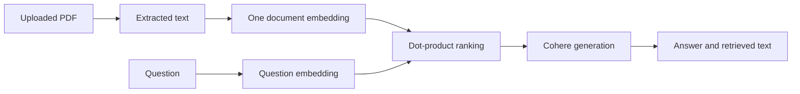

# PDF QA Bot

A Streamlit experiment that extracts text from a PDF, embeds the document and asks Cohere
to generate an answer from the retrieved text.

## How it works



[app.py](app.py) embeds each entire PDF with `all-MiniLM-L6-v2`; it does not split pages into
chunks. Retrieval uses a dot product, not normalized cosine similarity. The UI displays the
retrieved document text alongside the answer, without page-level citations.

## Local setup

```bash
git clone https://github.com/DanushArun/qa-bot-interface.git
cd qa-bot-interface
python3 -m venv .venv
source .venv/bin/activate
python -m pip install -r requirements.txt
```

Create a local `.env` containing `COHERE_API_KEY` with your own key, then run:

```bash
streamlit run app.py
```

The first embedding-model load downloads model files. Generation sends the selected document
text and question to Cohere. Use documents you are authorized to send to that provider.
The code selects `command-xlarge-nightly`; current model availability and SDK compatibility
were not verified with a live account during this documentation update.

## Repository contents

- [app.py](app.py): PDF extraction, embedding, retrieval, generation and UI.
- [requirements.txt](requirements.txt): pinned Python dependencies.
- A Dockerfile is stored inside an unusually named nested directory, not at the root.
  A root `docker build .` therefore does not use it.

## Evidence and limitations

Python syntax and README structure were checked. No paid API call or interactive QA evaluation
was performed, and there is no automated test suite in this checkout.

Document vectors are held in module-level lists and are not durable across reruns/restarts.
Streamlit reruns can reprocess uploads. Long PDFs exceed the embedding model's text window;
there is no OCR, chunk retrieval, relevance threshold or factual answer verification.
The prompt encourages use of context but does not enforce source-only answers.
