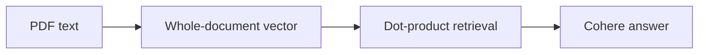

# PDF QA Bot — Architecture and implementation

This guide follows the tracked implementation. Proposed work is identified separately.

## The problem and the system boundary

A document question-answering demo should make the information sent to a model visible. This
application extracts PDF text, embeds the whole document and displays retrieved text with the
generated answer, exposing a basic retrieval/generation path and its limitations.

## Processing path

## End-to-end behavior

### 1. Upload a text PDF

PyPDF2 extracts text page by page. Image-only scans have no implemented OCR path.

### 2. Embed the whole text

The application creates one all-MiniLM-L6-v2 embedding for the complete document. Long text can be
truncated by the model rather than becoming a rich chunk index.

### 3. Ask a question

The query is embedded and dot-product scores rank in-memory document vectors. There is no
normalized-cosine calculation or relevance threshold.

### 4. Inspect the answer and context

The selected text and question are sent to Cohere. The UI shows context, but no page-level
citations or factual enforcement mechanism.

## Design choices and consequences

### Whole-document retrieval

The current data unit is the PDF text, not a page or paragraph chunk.

### Dot product is named accurately

The operation in source is not normalized cosine similarity.

### Context display is not verification

Visible retrieved text helps inspection but cannot guarantee grounded generation.

## Source entry points

### [app.py](../app.py)

- `load_model` — Implementation entry; inspect source for its exact behavior.
- `process_pdf` — Implementation entry; inspect source for its exact behavior.
- `embed_and_store` — Implementation entry; inspect source for its exact behavior.
- `retrieve` — Implementation entry; inspect source for its exact behavior.
- `generate_answer` — Implementation entry; inspect source for its exact behavior.
- `answer_question` — Implementation entry; inspect source for its exact behavior.

### [requirements.txt](../requirements.txt)

This file is part of the reviewed path described above. Follow its imports and calls
for the exact interface rather than inferring behavior from the filename.

## Implementation state

| State | Evidence boundary |
| --- | --- |
| Present | PDF extraction, embedding and answer UI source |
| Present | In-memory ranking and context display |
| Not present | OCR, page chunking or durable vector index |
| Not verified | Current provider model compatibility or answer accuracy |

“Present” means tracked source or assets exist. It does not mean a production or domain
validation has passed. See [Evaluation](EVALUATION.md) for reproducible checks and limits.
